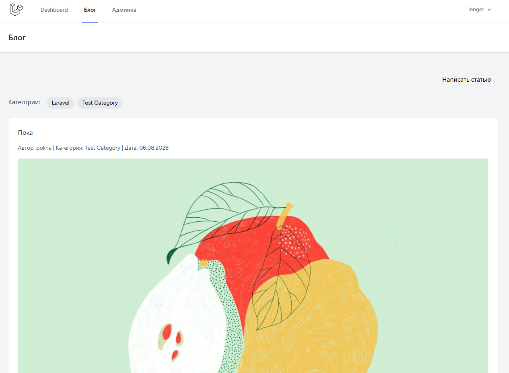
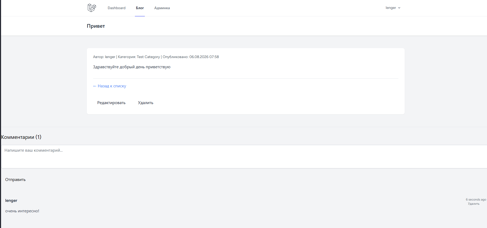
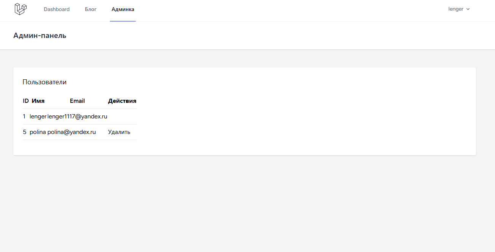

# Laravel Blog Engine (CMS-lite)
Классический блог на Laravel 13, созданный для демонстрации навыков backend-разработки, работы с базами данных, аутентификации и ролевой модели доступа.

# Функционал
- Аутентификация: Регистрация и вход пользователей через Laravel Breeze.
- Управление статьями (CRUD): Создание, редактирование, удаление и просмотр статей.
-- Поддержка обложек (загрузка изображений).
-- Автоматическая генерация уникальных URL (slug).
-- Валидация данных на стороне сервера.
- Комментарии: Возможность оставлять комментарии под статьями (только для авторизованных пользователей).
- Организация контента: Система категорий и тегов.
- Ролевая модель:
-- Автор: Может редактировать и удалять только свои статьи.
-- Администратор: Имеет полный доступ к управлению всеми статьями, комментариями и пользователями через админ-панель.
- Безопасность: Скрытие элементов управления (кнопок редактирования/удаления) для пользователей без прав доступа.

# Технологии
- Backend: PHP 8.4, Laravel Framework 13.x
- Database: SQLite
- Frontend: Blade Templates, Tailwind CSS
- Tools: Composer, NPM, Git

# Установка и запуск
1. Клонирование репозитория
```
git clone https://github.com/Lenger1117/blog
```
```
cd blog
```
2. Установка зависимостей
```
composer install
```
```
npm install && npm run build
```
3. Настройка окружения
```
cp .env.example .env
```
```
php artisan key:generate
```
4. Миграция базы данных
```
php artisan migrate
```
5. Настройка хранилища
Создайте символическую ссылку для доступа к загруженным изображениям:
```
php artisan storage:link
```
6. Запуск сервера
```
php artisan serve
```
### Теперь приложение доступно по адресу: http://127.0.0.1:8000

# Скриншоты



